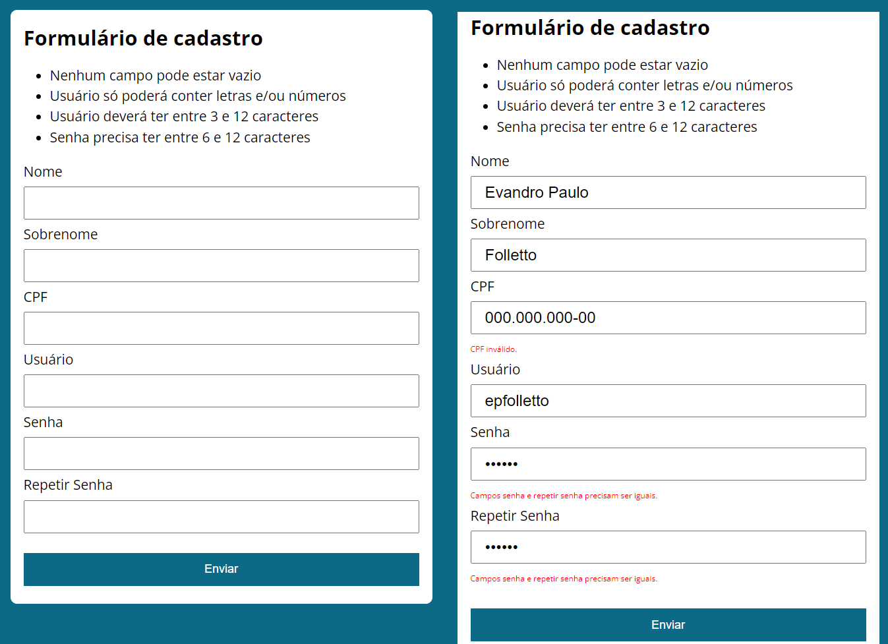

  <a href="#Projeto">Projeto</a> ◦ 
  <a href="#Descrição">Descrição</a> ◦ 
  <a href="#Status">Status</a> ◦ 
  <a href="#Sobre">Sobre</a> ◦ 
  <a href="#Funcionalidades">Funcionalidades</a> ◦ 
  <a href="#Tecnologias">Tecnologias</a> ◦ 
  <a href="#Link">Link</a> ◦ 
  <a href="#Autor">Autor</a>

# Projeto
Validação de cadastro

# Descrição
Formulário com cinco campos para preenchimento do usuário: Nome, Sobrenome, CPF, Usuário, Senha e Repetir Senha.
Na parte superior do formulário estão as observações de como este deve ser preenchido. Caso alguma destas exigências
não seja atendida, aparecerá uma mensagem vermelha de alerta.

  

# Status
Finalizado

# Sobre
Aplicação da Web desenvolvida com a finalidade de aprendizagem dos conteúdos de HTML5, CSS e JavaScript. 
O HTML da página é organizado da seguinte forma:
- head:
    - adiciona o título;
    - relaciona o arquivo de css chamado "style.css", que faz as configurações dos estilos.
- body
    - uma tag h1 para título;
    - uma tag ul para listas as exigências de preenchimento;
    - uma tag form com os cinco inputs;
    - um botão para o submit;
    - ao final faz a relação com os arquivos em JavaScript chamados "validaCPF.js" e "main.js".

O documento "main.js" possui as seguintes instruções:  
    - possui apenas uma classe denominada "ValidaFormulario";  
    - o evento de clique no submit é monitorado com "addEventListener" e seu comportamento padrão é prevenido, sendo direcionado para a função "handleSubmit";  
    - o método "handleSubmit" chama dois outros métodos: "camposSaoValidos()" e "senhasSaoValidas()";  
    - a verificação do CPF possui uma regra (para saber mais clique [aqui](https://dicasdeprogramacao.com.br/algoritmo-para-validar-cpf/)), para a qual foi criada a classe "ValidaCPF.js";  
    - caso os preenchimentos de todos os campos estão corretos, é exibida uma mensagem de alerta confirmando;  
    - ao final, é instanciada a classe com new "ValidaFormulario()".

# Funcionalidades
- [x] Campos de entrada de dados de Nome, Sobrenome, CPF, Usuário, Senha e Repetir Senha
- [x] Botão de iteração com o usuário para submeter os dados 
- [x] Mensagem de erro clara e personalizada para cada campo

# Link
A hospedagem foi feita utilizando o GitHub, que oferece serviço de hospedagem de sites.
- [URL do Site](https://epfolletto.github.io/validaCadastro/)

# Tecnologias

  

# Autor
Evandro Paulo Folletto

  
  
  

